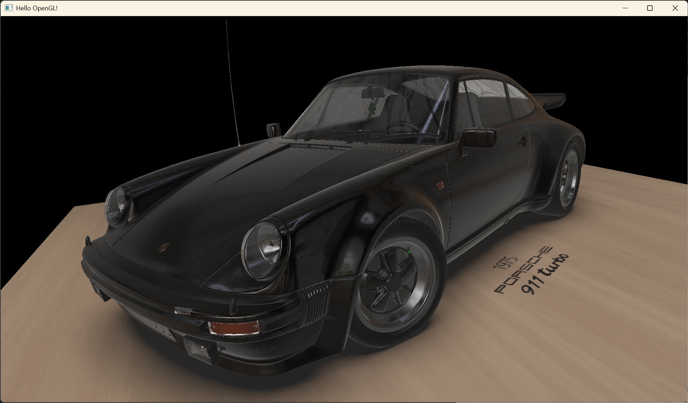
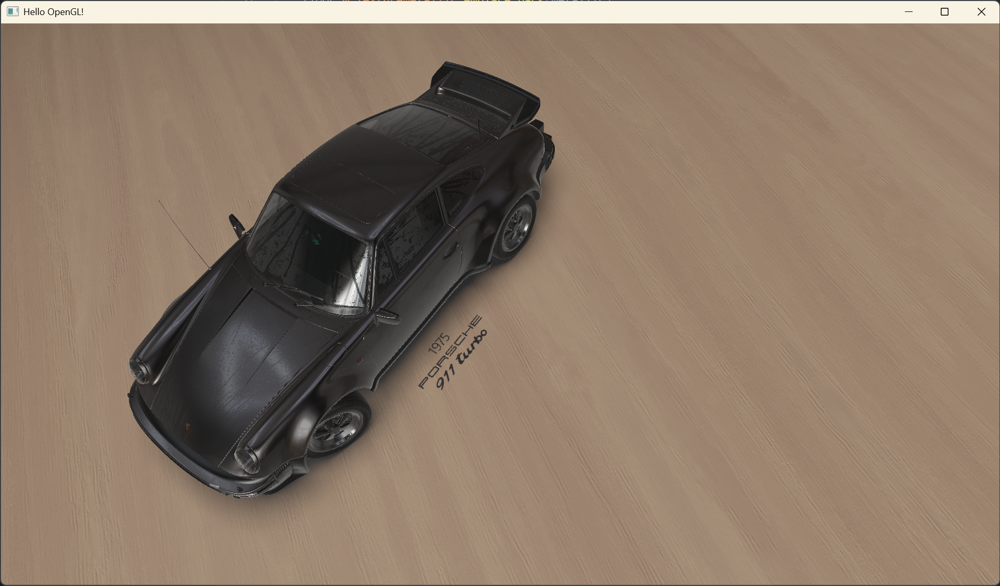

# OE_Engine — A Real-Time Rendering Engine Built with OpenGL

<p align="center">
  
</p>

> A real-time rendering engine built from scratch with **C++17 / OpenGL 4.6**, featuring **PBR (Physically Based Rendering)** and **Blinn-Phong** dual rendering pipelines, with a hybrid **Deferred Rendering** + **Forward Rendering** architecture.

---

## 📖 About

**OE_Engine** is a lightweight OpenGL real-time rendering engine built from scratch while learning computer graphics, based on the **[LearnOpenGL](https://learnopengl.com/)** tutorial. The goal is to integrate the concepts from the tutorial into a complete rendering engine framework, and to practice implementing modern rendering techniques on top of it.

The project consists of two main parts:

| Module | Description |
|--------|-------------|
| **OE_Engine** | Engine core, compiled as a static library (`.lib`), encapsulating rendering pipelines, lighting systems, shadows, model loading, and more |
| **Simple_Render_Application** | A sample rendering application built on the engine, containing multiple rendering experiment scenes |

> [!WARNING]
> This is an **early version** with many known issues and areas for improvement. It will be continuously iterated and refined.

---

## ✨ Rendering Features

### 🎨 PBR Pipeline (Cook-Torrance Metallic-Roughness Workflow)

- **Metallic-Roughness Workflow**
  - Supports Albedo, Metallic, Roughness, AO, Normal, and Emissive texture maps
  - Supports both separate texture channels and packed MRA textures (Metallic=B / Roughness=G / AO=R)
  - Per-map factor control (`albedoFactor`, `metallicFactor`, `roughnessFactor`)
- **Cook-Torrance BRDF**
  - **Normal Distribution Function (NDF)**: GGX / Trowbridge-Reitz
  - **Geometry Function**: Smith's Schlick-GGX (`k = (roughness+1)²/8`)
  - **Fresnel Equation**: Fresnel-Schlick approximation + roughness-corrected variant (for IBL)
- **Image Based Lighting (IBL)**
  - Diffuse Irradiance Map (DDS format, loaded via GLI)
  - Pre-filtered Radiance Map (multi-level Mipmap, LOD = roughness × 7.0)
  - BRDF Look-Up Table (BRDF LUT, RGB16F)
  - Split-Sum approximation for environment lighting
- **Transmission / Refraction**
  - glTF `KHR_materials_transmission` extension support
  - Screen-space refraction (IOR control, default 1.5)
  - Total Internal Reflection (TIR) detection
  - Roughness-attenuated background sampling
- **Alpha Cutoff / Masked Rendering**: `cutOff` threshold-based alpha mask discard

### 💡 Blinn-Phong Pipeline

> [!CAUTION]
> The Blinn-Phong pipeline is currently in a **semi-deprecated state** and may not function correctly. It is recommended to use the **PBR pipeline** for rendering.

- **Blinn-Phong lighting model** (Ambient + Diffuse + Specular)
- Normal mapping support (TBN tangent-space transform)
- Deferred + Forward dual rendering paths
- Gamma correction (input linearization `pow(color, 2.2)`)

### 🔦 Lighting System

| Light Type | Max Count | Description |
|------------|-----------|-------------|
| **Directional Light** | 1 | Toggle on/off, color configuration, shadow casting |
| **Point Light** | 4 | Distance attenuation (`1/(c + l·d + q·d²)`) |
| **Spot Light** | 4 | Inner/outer cone angle, distance attenuation, direction control |
| **IBL Ambient** | 1 | Irradiance + Pre-filtered environment map + BRDF LUT |

### 🌑 Shadow System

- **Directional Shadow Map**
  - Orthographic projection shadow capture
  - PCF (Percentage Closer Filtering) 3×3 kernel soft shadows
  - Adaptive slope-scale bias (`max(0.005 × (1 - dot(n, l)), 0.0005)`)
  - Shadow map border clamping (`GL_CLAMP_TO_BORDER`)
  - Configurable shadow resolution (default 1024×1024)
- **Omnidirectional Point Light Shadow Map**
  - Cube Map based depth rendering
  - Geometry shader single-pass rendering for all 6 faces (`gl_Layer`)
  - Linear depth storage (`length(lightPos - fragPos) / farPlane`)
  - 20-direction PCF soft shadows
  - Lazy re-capture: shadow maps are only regenerated when light position changes

### 🌫️ Screen-Space Ambient Occlusion (SSAO)

- 64 hemisphere random sample kernels (accelerated distribution, dense sampling near surface)
- 4×4 random rotation noise texture (`GL_RGB16F`)
- Noise-based TBN rotation + Gram-Schmidt orthogonalization
- `smoothstep` range check (prevents distant geometry contribution)
- 4×4 Box Blur denoising
- Affects only ambient component (`ambient × ao × ssao`)

### 🔀 Hybrid Rendering Architecture (Deferred + Forward)

The engine uses a **hybrid deferred/forward rendering** architecture:

| Rendering Path | Target Objects | Description |
|----------------|----------------|-------------|
| **Deferred** | Opaque / Masked objects | G-Buffer with Multiple Render Targets (MRT) |
| **Forward** | Transparent / TransparentMasked objects | Distance-sorted translucent rendering |

**G-Buffer Layout** (6 color attachments, `GL_RGB16F` / `GL_RGBA16F`):

| Attachment | Content |
|------------|---------|
| 0 | World-space position |
| 1 | Light-space position (for shadow calculation) |
| 2 | Normal vector (`n×0.5+0.5` encoding) |
| 3 | Albedo (RGB) + Alpha |
| 4 | Metallic(R) / Roughness(G) / AO(B) |
| 5 | Emissive (RGB) |

**Rendering Flow**:
1. **G-Buffer Pass** → Render opaque / masked objects to G-Buffer
2. **SSAO Pass** → Compute SSAO from position + normal G-Buffer
3. **SSAO Blur Pass** → 4×4 Box Blur smoothing
4. **Deferred Lighting Pass** → Full-screen quad reads G-Buffer + SSAO + shadow maps, computes full PBR/Phong lighting
5. **Depth Buffer Blit** → `glBlitFramebuffer` copies depth information
6. **Skybox Rendering**
7. **Forward Pass** → Transparent objects sorted back-to-front (blending enabled, depth write disabled)

### 🌌 SkyBox

- 6-face cubemap loading (`px/nx/py/ny/pz/nz`)
- Standard image formats and **HDR format** (`.hdr`, `GL_RGB16F`) support
- Infinite distance rendering trick (`gl_Position = pos.xyww` + `GL_LEQUAL`)
- Translation-stripped view matrix (`mat4(mat3(view))`)

### 🖼️ Post-Processing & Rendering Pipeline

- **HDR Rendering**: All render targets use 16-bit floating point format (`GL_RGB16F` / `GL_RGBA16F`)
- **Reinhard Tone Mapping** (HDR → LDR)
- **Gamma Correction** (input texture linearization `pow(color, 2.2)`)
- **Framebuffer Object (FBO)** off-screen rendering
- **Multiple Render Targets (MRT)** G-Buffer support

---

## 🏗️ Engine Architecture

### Core Modules

```
OE_Engine/src/
├── Renderer              # Renderer — Window creation, viewport management, blend/depth/stencil test control
├── Camera                # Camera system — Perspective/orthographic projection, mutex-protected
├── CameraController      # Camera controller — WASD movement + mouse rotation, configurable key bindings
├── Shader                # Shader management — Compile/link/uniform caching, VS/FS/GS support
├── Model                 # Model loading — Assimp-based, supports glTF/OBJ and more
├── Object                # Render object — Geometry + material + transform, 6-attribute vertex layout
├── Material              # Material system — Opaque/Masked/Translucent blend modes
├── Texture               # Texture management — Reference counting + caching, 2D/HDR/Cubemap/DDS
├── RenderTarget          # Framebuffer (FBO) — Up to 6 color attachments + depth/stencil attachments
├── PBRPipeline           # PBR rendering pipeline (deferred + forward hybrid)
├── PhongLight            # Blinn-Phong rendering pipeline (deferred + forward hybrid)
├── ShadowMapDirection    # Directional shadow (orthographic projection + PCF)
├── ShadowMapPoint        # Point light shadow (CubeMap + geometry shader)
├── SkyBox                # Skybox (standard + HDR formats)
├── EngineConfig          # Engine configuration — Pipeline selection, texture slot allocation (26 reserved slots)
└── Helper                # Utilities — MikkTSpace tangent calculation, primitive geometry generation
```

### Key Technical Highlights

- **MikkTSpace Tangent Calculation**: Uses the `mikktspace` library for tangent-space computation, ensuring correct normal mapping
- **Material-Sorted Rendering**: Automatically sorts objects by Opaque → Masked → Transparent for rendering
- **Texture Caching with Reference Counting**: Avoids duplicate GPU texture loads, auto-releases when reference count reaches zero
- **Instanced Rendering**: GPU instanced rendering support (asteroid belt demo: 7,777 instances)
- **Full glTF PBR Material Support**: Albedo/Metallic/Roughness/AO/Normal/Emissive/Transmission + default value fallbacks
- **Modern OpenGL Features**: Uses DSA (`glBindTextureUnit`, `glProgramUniform*`) and other OpenGL 4.5+ features
- **Compile-Time Pipeline Switching**: Switch between PBR and Blinn-Phong pipelines via `#define`

### Sample Scenes

| Scene | Pipeline | Description |
|-------|----------|-------------|
| **PBRLighting** | PBR | 1975 Porsche 911 Turbo (glTF) + wooden floor + IBL + shadows |
| **AdvancedLighting** | Blinn-Phong | Character model + directional shadow + HDR + deferred rendering |
| **InstanceExperiment** | Blinn-Phong | Planet + 7,777 asteroids GPU instanced rendering |
| **RenderTargetExperiment** | Blinn-Phong | Backpack model + skybox cubemap reflection + post-processing |
| **StencilTestExperiment** | Blinn-Phong | Stencil-based outline rendering + depth visualization |
| **DrawASimpleHouseUsingGS** | Blinn-Phong | Geometry shader demo (4 vertices → house) |

---

## 🛠️ Build Guide

### Requirements

| Dependency | Description |
|------------|-------------|
| **CMake** | ≥ 3.15 |
| **C++ Compiler** | C++17 support (MSVC / GCC / Clang recommended) |
| **vcpkg** | Package manager for installing third-party dependencies |

### Third-Party Dependencies

**Installed via vcpkg:**

| Library | Purpose |
|---------|---------|
| **GLFW3** | Window management and input handling |
| **GLM** | Math library (vector, matrix operations) |
| **stb** | Image loading (stb_image) |
| **Dear ImGui** | Immediate mode debug UI |
| **Assimp** | 3D model import (supports glTF, OBJ, FBX, and more) |
| **MikkTSpace** | Tangent space computation |

**Local dependencies (in the `Dependences/` directory):**

| Library | Purpose |
|---------|---------|
| **GLAD** | OpenGL function loader |
| **GLI** | OpenGL texture image library (DDS cubemap loading) |

### Build Steps

#### 1. Clone the Project

```bash
git clone <repository-url>
cd OE_Engine
```

#### 2. Install vcpkg (if not already installed)

```bash
# Install vcpkg in the parent directory (CMakeLists.txt defaults to ../vcpkg/)
cd ..
git clone https://github.com/microsoft/vcpkg.git
cd vcpkg
./bootstrap-vcpkg.bat   # Windows
# or
./bootstrap-vcpkg.sh    # Linux / macOS
cd ../OE_Engine
```

#### 3. Configure and Build with CMake

```bash
# Create build directory
mkdir build && cd build

# Configure the project (CMake will automatically install dependencies via vcpkg toolchain)
cmake .. -DCMAKE_TOOLCHAIN_FILE="../vcpkg/scripts/buildsystems/vcpkg.cmake"

# Build
cmake --build . --config Release
```

#### 4. Using Visual Studio (Recommended for Windows)

```bash
# Generate Visual Studio solution
cmake .. -DCMAKE_TOOLCHAIN_FILE="../vcpkg/scripts/buildsystems/vcpkg.cmake"

# Open build/OE_Engine.sln
```

> [!TIP]
> The working directory is already configured in CMake to the `Simple_Render_Application/` directory. The program will automatically read shaders, textures, and model assets from the `res/` folder under that directory. No manual working directory setup is needed when debugging with Visual Studio.

---

## 🖼️ Rendering Showcase

**1975 Porsche 911 Turbo** model rendered with the PBR pipeline (deferred + forward hybrid) and IBL (Image Based Lighting). The two screenshots use different IBL environment maps:

<p align="center">
  
  <br/>
  <em>▲ Screenshot 1</em>
</p>

<p align="center">
  
  <br/>
  <em>▲ Screenshot 2</em>
</p>

---

## 🗺️ Roadmap

- [ ] Optimize engine architecture and rendering performance, fix known bugs
- [ ] Introduce Anti-Aliasing
- [ ] Replace OpenGL with **Vulkan**
- [ ] Ray Tracing + DLSS? (TBD)

---

## 🙏 Acknowledgements

### Learning Resources

- **[LearnOpenGL](https://learnopengl.com/)** — The primary learning reference for this project

### Free Assets

Free resources used in the sample scenes — thanks to the following authors and platforms for their generous sharing:

| Resource | Source |
|----------|--------|
| 🚗 Porsche 911 Turbo vehicle model | [Sketchfab — Free 1975 Porsche 911 (930) Turbo](https://sketchfab.com/3d-models/free-1975-porsche-911-930-turbo-8568d9d14a994b9cae59499f0dbed21e) |
| 🪵 Wood floor PBR material | [FreePBR — Bare Wood 1](https://freepbr.com/product/bare-wood1/) |
| 🌅 Environment HDR map | [Poly Haven — Mirrored Hall](https://polyhaven.com/a/mirrored_hall) |
